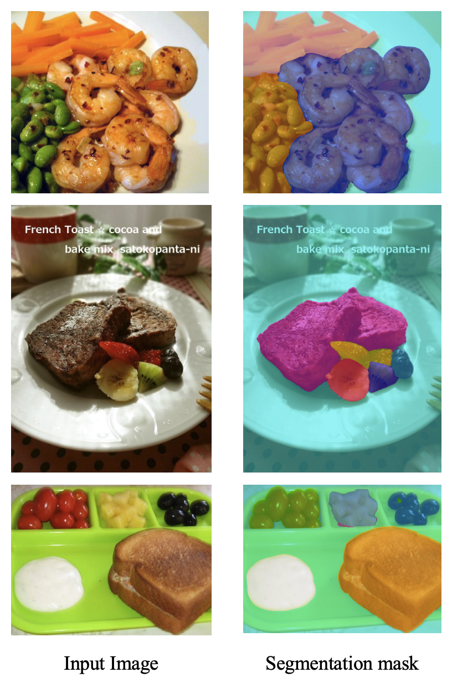

# FoodSAM: Semantic Segmentation for Food Images with SAM Enhancement

Re-implementation of [FoodSAM (arXiv:2308.05938)](https://arxiv.org/abs/2308.05938), a framework that enhances semantic segmentation results using SAM-based instance-level masks.

---

## Installation

We recommend using Python 3.7 and PyTorch 1.8.1 + CUDA 11.1. Other versions may work but are not tested.
### 0. Download dataset (FoodSeg103)
Please download the required checkpoints from the following Google Drive folder and place them into the `ckpts/` directory:  
[Download Checkpoints](https://drive.google.com/file/d/1dqL2x_Zdi3J-dp-EV_rFJ_zVUVveAVgl/view?usp=drive_link)

### 1. Create conda environment
```bash
conda create -n FoodSAM python=3.7 -y
conda activate FoodSAM
```

### 2. Install dependencies
```bash
# PyTorch
pip install torch==1.8.1+cu111 torchvision==0.9.1+cu111 torchaudio==0.8.1 -f https://download.pytorch.org/whl/torch_stable.html

# MMCV
pip install mmcv-full==1.3.0 -f https://download.openmmlab.com/mmcv/dist/cu110/torch1.8.0/index.html

# SAM
pip install git+https://github.com/facebookresearch/segment-anything.git@6fdee8f

# Others
pip install -r requirement.txt
```

### 3. Download checkpoints
Please download the required checkpoints from the following Google Drive folder and place them into the `ckpts/` directory:  
[Download Checkpoints](https://drive.google.com/drive/folders/1XhkxfVW2Y1vwvwv4j4eotKRlVUsvsVYN?usp=drive_link)

---

## Directory Structure
```
FoodSAM
├── ckpts/
│   ├── sam_vit_h_4b8939.pth
│   ├── iter_80000.pth  (SETR_MLA)
│   └── Unified_learned_OCIM_RS200_6x+2x.pth
├── configs/
│   ├── SETR_MLA_768x768_80k_base.py
│   └── Unified_learned_OCIM_RS200_6x+2x.yaml
├── dataset/
│   └── FoodSeg103/
│       └── Images/
│           ├── ann_dir/
│           └── img_dir/
├── inference_utils.py
├── inference.ipynb
```

---

## Inference

### 1. Inference by running Bash Scripts

- **Single Image Inference**  
  To run inference on a single image, execute:

  ```bash
  bash scripts/single_inference.sh
  ```

- **Folder Inference**  
  To run batch inference on a folder of images:

  ```bash
  bash scripts/folder_inference.sh
  ```

- **Evaluation on Test Set**  
  To evaluate segmentation performance on the FoodSeg103 test set:

  ```bash
  bash scripts/evaluation.sh
  ```

### 2. Inference using Jupyter Notebook

- Open `inference.ipynb` and modify the `img_path` variable to point to your input image:

  ```python
  from inference_utils import load_sam_model, run_inference, show_results
  from PIL import Image

  generator = load_sam_model()
  img_path = "./test.jpg"  # Specify your image path here
  image = Image.open(img_path).convert("RGB")
  original, overlay = run_inference(image, generator)
  show_results(original, overlay)
  ```
  
---

## Quantitative Results

| Metric       | Value  |
|--------------|--------|
| mIoU         | 46.48  |
| Mean Acc     | 58.28  |
| Overall Acc  | 84.11  |

---

## Qualitative Results

The following figure shows example outputs from FoodSAM, illustrating how the model performs semantic segmentation on food images.


